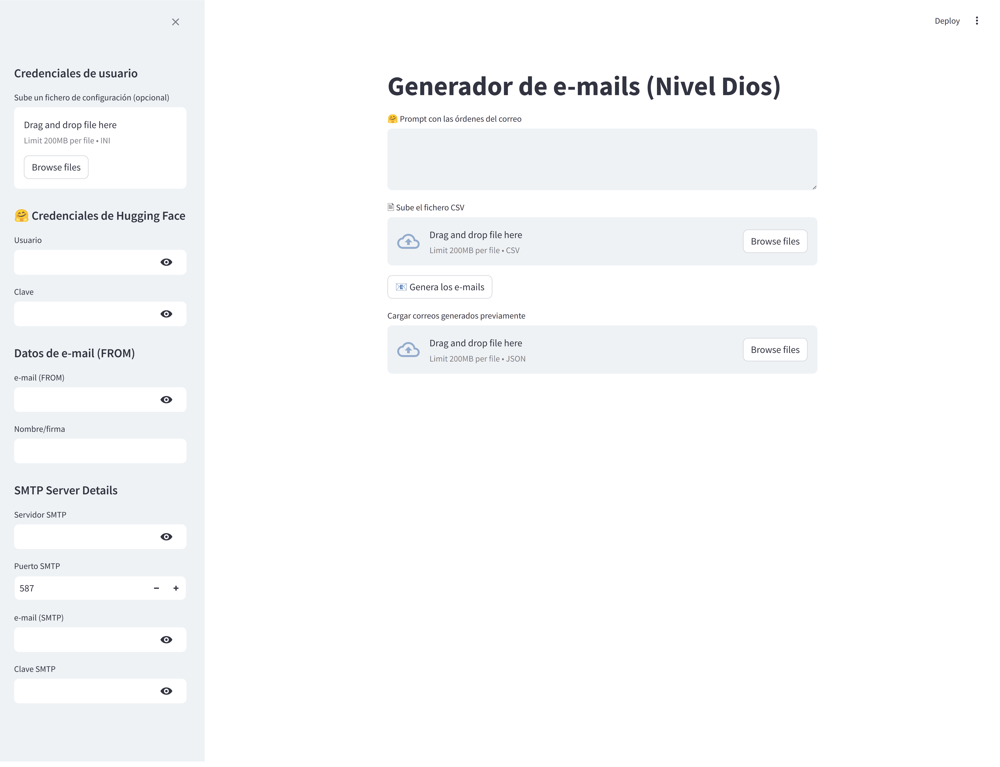

# correspondenciaNivelDios

Este programa se organiza en dos carpetas. Por un lado, el programa más sencillo que permite generar los emails pero no enviarlos (correspondencia-email), por otro, una versión más sofisticada con interfaz en streamlit (correspondencia-email-streamlit) que sí permite el envío de correos.



Ambos programas comparten instrucciones de instalación.

# Manual de instalación

## Instalación de Python y pip

Para utilizar el generador de emails, primero debes asegurarte de tener Python y pip instalados en tu sistema. A continuación, se describen los pasos para instalarlos en Windows, Linux y macOS:

### Windows

1. Descarga el instalador de Python desde el sitio oficial. Ejecuta el instalador y sigue las instrucciones para instalar Python.
2. Abre la línea de comandos (cmd) y verifica que Python esté instalado ejecutando el comando `python --version`.
3. Instala pip ejecutando el comando `python -m ensurepip --upgrade`.

### Linux

1. Abre la terminal y ejecuta el siguiente comando para instalar Python:
   ```bash
   sudo apt-get update
   sudo apt-get install python3
   ```
2. Verifica que Python esté instalado ejecutando el comando `python3 --version`.
3. Instala pip ejecutando el comando `sudo apt-get install python3-pip`.

### macOS

1. Abre la terminal y ejecuta el siguiente comando para instalar Python:
   ```bash
   brew install python
   ```
2. Verifica que Python esté instalado ejecutando el comando `python3 --version`.
3. Instala pip ejecutando el comando `sudo easy_install pip`.

**NOTA**:

> Es muy posible que tengas que usar la orden ```python3``` en lugar de ```python```, dependiendo de la instalación de tu sistema.

## Bibliotecas necesarias

1. (OPCIONAL) Crea un entorno virtual con el comando `python -m venv nombre_del_entorno`.
2. (OPCIONAL) Activa el entorno virtual:
   - En Windows: `nombre_del_entorno\Scripts\activate`
   - En Linux/macOS: `source nombre_del_entorno/bin/activate`
3. Instala las dependencias necesarias con el comando `pip install -r requirements.txt`.

para instalar las dos bibliotecas necesarias. 

## Uso de la aplicación ```correspondencia-email```

Para que la aplicación funcione correctamente, debes crear tres archivos en la carpeta donde se encuentra el programa `generador-emails.py`:

1. **message.txt**: Este archivo debe contener las órdenes para enviar los correos a la lista.
2. **tabla.csv**: La tabla de contactos con 4 columnas: Nombre, Apellidos, Nivel de amistad y correo, **delimitadas por ; en lugar de ,**. Aquí tienes un ejemplo de `tabla.csv`:

```csv
Ana;Pérez García;4;ana.perez@email.com
Luis;Rodríguez;3;luis.rodriguez@email.com
María;López;5;maria.lopez@email.com
Fernando;García;2;fernando.garcia@email.com
```

3. **credentials.ini**: Fichero de configuración con la cuenta de Hugging Face, el correo y el nombre del firmante, así como las credenciales para el servidor SMTP. Aquí tienes un ejemplo de `credentials.ini`:

```ini
[hugging-chat]
hf-email = tu_direccion_de_correo_para_hugging_face@email.com
hf-passwd = tu_clave_de_hugging_face

[email]
acc-email = tu_direccion_de_correo_para_enviar_correo@email.com
sign-name = Tu_nombre_o_firma

[smtp]
smtp_server = servidor_smtp.com
smtp_port = 587
smtp_email = direccion_de_correo_smtp@email.com
smtp_password = tu_clave_smtp
```

Ejecuta el programa, desde la misma carpeta, con `python generador-emails.py`.

El sistema creará los correos de forma automática, siguiendo un formato EML. Los correos generados se guardarán en la carpeta llamada "correos".

## Uso de la aplicación ```correspondencia-email-streamlit```

Para ejecutar la aplicación puedes escribir, en la misma carpeta, la siguiente orden:

```bash
streamlit run email-sender.py
```

Puedes usar el archivo `credentials.ini` del anterior programa si no quieres introducir los datos de las credenciales a mano.

## Notas finales

En la carpeta ejemplo tienes varios ficheros de ejemplo que puedes usar como plantilla y para realizar las pruebas.

Puedes ver el vídeo de demostración aquí:

<https://youtu.be/xF0qNxo1TSU>
